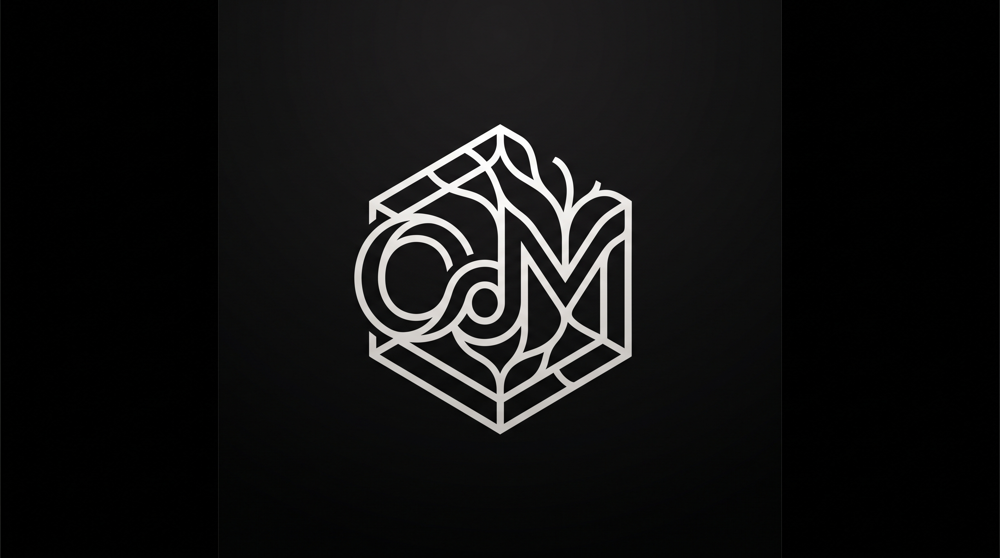

<p align="center">
  
</p>

# OO-OdM — Organique des Matières
### *A Science of Matter Before All Sciences*

> **"She does not depend on other sciences to exist. The relations with other sciences come afterwards."**
> — *plan.md, founding line*

---

## 🇫🇷 Français | 🇬🇧 English below

---

## Qu'est-ce que l'Organique des Matières ?

L'**Organique des Matières (OdM)** est une science fondamentale en cours de construction dont l'objet est la matière dans son sens le plus général — non pas les atomes (physique), ni les molécules (chimie), ni les cellules (biologie), mais les **blocs**, leurs **relations**, leurs **transformations**, et les **émergences** qui en résultent.

Elle repose sur un vocabulaire minimal :

| Entité | Rôle |
|---|---|
| **Bloc** | L'unité élémentaire de toute matière |
| **Forme** ○ △ □ ★ | Les 4 formes canoniques de tout bloc |
| **Relation** | Ce qui lie ou sépare les blocs |
| **Organisation** | Un ensemble structuré de blocs et relations |
| **Émergence ★** | Ce qui apparaît et n'existait pas avant |

Et sur **7 opérations fondamentales** :

```
LIAISON · RUPTURE · TRANSFORMATION · COMPOSITION
CONTENIR · DIVISION · CARACTÉRISATION
```

Ces 7 opérations permettent de décrire **n'importe quel phénomène** — physique, biologique, cognitif, social — avec le même langage.

---

## Architecture Technique

OdM est implémentée comme le **laboratoire scientifique interne** de [OO (Operating Organism)](https://github.com/DjibyDiop/Operating-Organism), un système d'exploitation organique natif.

```
oo-odm/
├── meo/              # MEO : Moteur d'Exploration Organique (Python)
├── omx/              # OMX : Bus d'interopérabilité natif (OIR Protocol v1.0)
│   ├── o_dplus.py    # Moteur D+ (organes compilés natifs)
│   ├── o_cpp.py      # Moteur C++ SIMD HPC (ocpp_engine.exe)
│   ├── o_rust.py     # Moteur Rust IPC (oir-rust.exe)
│   └── o_py.py       # Moteur Python IA/Information
├── dplus/            # Organes natifs D+ (compilés par dpc.exe)
│   ├── odm_core.plus         # Les 7 opérations fondamentales en D+ pur
│   ├── odm_ontology.plus     # Ontologie des 4 formes (○ △ □ ★)
│   ├── odm_sandbox.plus      # Constitution & Arbitrage (D+ Judge)
│   └── odm_possibilities.plus# Champ des possibilités & trajectoires
├── odm_core_v02/     # Expériences OdM (EXP-001 → EXP-006)
└── test_all_odm.py   # Runner unifié — 16/16 suites (Zero Mocks)
```

### Moteurs Natifs (Zéro Mocks)

| Moteur | Technologie | Rôle |
|---|---|---|
| **O-D+** | D+ (dpc.exe) | Arbitrage constitutionnel, ontologie, opérations |
| **O-CPP** | C++ SIMD | Expansion combinatoire HPC (512 trajectoires) |
| **O-RUST** | Rust | IPC strict, frames JSON natifs |
| **O-PY** | Python | Entropie de Shannon, heuristiques topologiques |

---

## Résultats Certifiés

```
OO-ODM UNIFIED SOVEREIGN TEST SUITE
==================================================
RESULTS: 16 / 16 suites passed (100%)
==================================================
```

| Expérience | Description | Statut |
|---|---|---|
| EXP-001 | Séquence canonique (LIAISON → DIVISION) | ✅ |
| EXP-002 | Boucle autonome (cycle complet) | ✅ |
| EXP-003 | Machine de découverte | ✅ |
| EXP-004 | Boucle fermée OO ↔ OdM | ✅ |
| EXP-005 | Organisme de Possibilités (6 compartiments, H=2.591 bits) | ✅ |
| **EXP-006** | **Moteur Cœur D+ Natif — Les 7 Opérations bout-en-bout** | ✅ |

---

## L'Organisme de Possibilités

Le cœur d'OdM est son **Organisme de Possibilités** — un système qui maintient en temps réel 6 compartiments :

```
┌──────────────────────────────────────────────────────────┐
│  EXISTANT   │ Ce qui est — blocs, relations, organisations│
│  POSSIBLES  │ Ce qui peut être — actions légales valides  │
│  EXPLORÉ    │ Ce qui a été — trajectoires parcourues      │
│  ÉMERGENCES │ ★ Ce qui est apparu — singularités          │
│  INTERDITS  │ Ce qui ne peut pas être — D+ Gate           │
│  INEXPLORÉ  │ Ce qui reste — frontière ouverte            │
└──────────────────────────────────────────────────────────┘
```

---

## Principe Fondateur : Zéro Mocks

> Toute intégration repose sur des binaires natifs réels, compilés, exécutés.
> Aucun stub. Aucune simulation. La réalité ou rien.

---

## Installation

```bash
git clone https://github.com/DjibyDiop/oo-odm.git
cd oo-odm

# Prérequis : dpc.exe, ocpp_engine.exe, oir-rust.exe
# (fournis par le projet OO : https://github.com/DjibyDiop/Operating-Organism)

python test_all_odm.py
```

---

## Roadmap

- [x] MEO — Moteur d'Exploration Organique
- [x] OIR Protocol v1.0 (interopérabilité native)
- [x] Les 4 Formes et 7 Opérations en D+ pur
- [x] Organisme de Possibilités (6 compartiments)
- [x] EXP-001 → EXP-006 certifiées (16/16)
- [ ] Grammaire opérationnelle formelle (avant/après, contexte, résultat Q)
- [ ] Système de lois et conditions d'application
- [ ] Mesure organique (profondeur, distance, richesse d'émergence)
- [ ] Langage de surface OdM (au-dessus de D+)
- [ ] Protocole d'adoption de connaissance OdM → OO
- [ ] Publication preprint (arXiv)

---

## Auteur

**Djiby Diop** — [djibydiopwr@gmail.com](mailto:djibydiopwr@gmail.com)

Idée fondatrice, architecture, et implémentation intégrale.

---

## English Summary

**OO-OdM** is the scientific laboratory of the [Operating Organism (OO)](https://github.com/DjibyDiop/Operating-Organism) project. It implements *Organique des Matières* — a foundational science of matter in the general sense, built on 4 canonical forms (○ △ □ ★) and 7 fundamental operations (LIAISON, RUPTURE, TRANSFORMATION, COMPOSITION, CONTENIR, DIVISION, CARACTÉRISATION).

The system is fully operational, multi-engine (D+, C++, Rust, Python), zero-mocks, and passes 16/16 test suites. Its core insight: **any phenomenon in any domain can be described with the same minimal vocabulary of blocks, relations, and emergences.**

---

*"She transforms dreams into possibilities."* — plan.md
